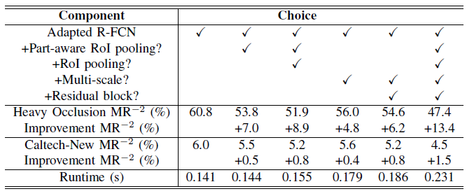

# A Part-Aware Multi-Scale Fully Convolutional Network for Pedestrian Detection


## Introduction

We present a part-aware multi-scale FCN for pedestrian detection. In this method, the part-aware RoI pooling module can generate high detection confidence score for occluded pedestrians, while the multi-scale FCN is constructed to detect small-scale and large-scale pedestrians respectively on feature maps of different resolutions.

## Installation
1. Clone the PAMS-FCN repository into `$PAMS_ROOT`
```
git clone
```

2. Build the Cython modules
```
cd $PAMS_ROOT/lib
make
```

3. Build Caffe and pycaffe
```
cd $PAMS_ROOI/caffe
make -j8 && make pycaffe
```

## Train/Eval
1. Prepare the training, val, test data
2. Train the PAMS-FCN detector. Outputs are svaed under $PAMS_ROOI/output/
```
python model/pams/xxx.py
```
3. Test the PAMS-FCN detector. Outputs are svaed under $PAMS_ROOI/output/
```
python model/pams/xxx.py
```

## Main Results
We conduct an ablation study to validate the effectivenss of the proposed network.

**Table 1**. Result of the ablation study on the Heavy Occlusion subset of the Caltech Dataset and the Caltech-New dataset. Runtime is evaluated on a single GTX 1080Ti GPU per image.




haha *empha1* and **empha2** hh


link ex:

For more information, you can refer to [Chai benchmarks](https://github.com/chai-benchmarks/chai "Title")....


